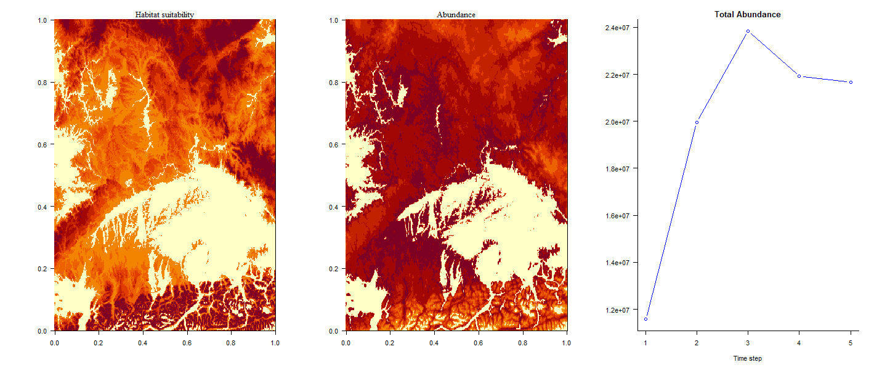

```{r setup, include=FALSE}
knitr::opts_chunk$set(echo = TRUE)
```


metaRange is the project i'm working on for my Master Thesis. 


It is a process-based mechanistic species distribution model, that explicitly includes stochastic as well as metabolic processes.
It is implemented as an R package [metaRange](https://srfall.github.io/metaRange) (website coming soon).

This model serves two different purposes. Firstly, it should serve as a general mechanistic distribution model, that can be used to study theoretical questions about the distribution of species and how this arises from the metabolic interactions between the environment and the species.

Secondly, its purpose is to predict the future distribution of species in the real world, based on empirical data.

Contributors are [Juliano Sarmento Cabral](https://github.com/julianoscabral) & [Lea Li](https://github.com/li-lea)

